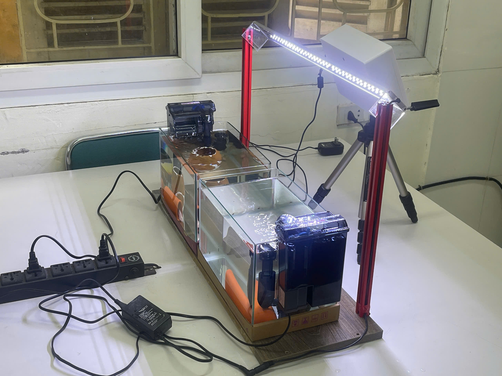

<!-- Generated from scientific source; do not edit this copy directly. -->

# Xây dựng hệ thống thu nhận và lưu trữ dữ liệu

<section class="journal-meta" aria-label="Thông tin bài nhật ký">
Mã nhật kýJ01

ExperimentEXP-01

Ngày2026-07-30

Trạng tháiĐã xác minh · VERIFIED

Evidencelow

Cập nhật2026-08-29
</section>

## 1. Mục tiêu

Xây dựng nền tảng có thể thu hình cá liên tục, lưu dữ liệu theo nguồn camera và chuẩn bị ghép với dữ liệu cảm biến môi trường trước khi phát triển mô hình AI.

## 2. Vấn đề cần giải quyết

Nếu video, sensor và log không được tổ chức ngay từ đầu, nhóm khó truy lại điều kiện thí nghiệm hoặc tái lập kết quả. Hệ thống cũng cần giảm nguy cơ mất dữ liệu khi thiết bị ghi hình gặp sự cố.

## 3. Thiết bị, dữ liệu và phần mềm

Yêu cầu phiên cho biết nhóm đã dùng Raspberry Pi, camera và thử `rclone` với Google Drive. Repository hiện có raw video/sensor và quy định Drive là nơi lưu nguồn dài hạn, nhưng không còn `collector.log`, cấu hình mount hay ảnh setup để xác minh đầy đủ giai đoạn này.

## 4. Phương pháp thực hiện

Thiết kế dự kiến gồm camera ghi vào thư mục theo nguồn/phiên, metadata sensor gắn `session_id` và bản sao lưu ngoài thiết bị. Dữ liệu nặng nằm ngoài Git; Git chỉ giữ notebook, log, kết quả nhỏ và metadata.

## 5. Quá trình thực hiện

Theo mô tả cần xác minh, nhóm ưu tiên hệ thống thu dữ liệu trước khi huấn luyện AI, sau đó kiểm tra `rclone mount`, đường dẫn mount và file log bằng terminal. Các bước sửa lỗi cụ thể không được tái dựng vì artifact gốc không có trong repository hiện tại.

## 6. Kết quả và quan sát

Raw video TOP/FRONT và hai sensor JSON hiện có cho thấy một hệ thống thu dữ liệu đã tạo được đầu vào sử dụng về sau. Tuy nhiên, evidence hiện tại không chứng minh cơ chế collector/rclone, độ ổn định dài hạn hoặc ngày 30/07/2026.

## 7. Vấn đề phát sinh

Các vấn đề `rclone mount`, đường dẫn và `collector.log` mới chỉ đến từ mô tả của phiên. Không có log để phân biệt lỗi nào đã xảy ra, cách sửa nào đã áp dụng và kết quả cuối ra sao.

## 8. Điều chỉnh và cải tiến

Workflow hiện tại tách rõ Drive là nguồn lưu trữ raw, local là working copy và Git là kho evidence. Các lần thu tiếp theo nên ghi manifest, checksum, thời gian, camera, tank và sensor ngay khi kết thúc phiên.

## 9. Kết luận tại thời điểm thực hiện

Nền tảng thu dữ liệu có bằng chứng gián tiếp qua dữ liệu đầu ra, nhưng câu chuyện triển khai ban đầu chỉ đạt `PARTIAL`. Không dùng mốc 30/07/2026 như ngày đã xác minh cho đến khi bổ sung evidence.

## 10. Minh chứng

- [`FISH_AI_PROJECT_WORKFLOW.md`](https://github.com/khkt-tn/fish/blob/main/FISH_AI_PROJECT_WORKFLOW.md)
- [`data source inventory log`](https://github.com/khkt-tn/fish/blob/main/logs/data/notebook01_summary.txt)
- [Danh sách unresolved](https://github.com/khkt-tn/fish/blob/main/research_diary/evidence/unresolved.md)

## 11. Hình ảnh minh họa

*Hình 11.1. Hệ thống Raspberry Pi và camera sử dụng để thu nhận dữ liệu.*

## 12. Đóng góp của thành viên

Quang Anh - Quốc Minh

## 13. Công việc tiếp theo

Học sinh bổ sung log/ảnh gốc và xác nhận ngày; không đưa credential rclone hoặc raw video vào Git.
