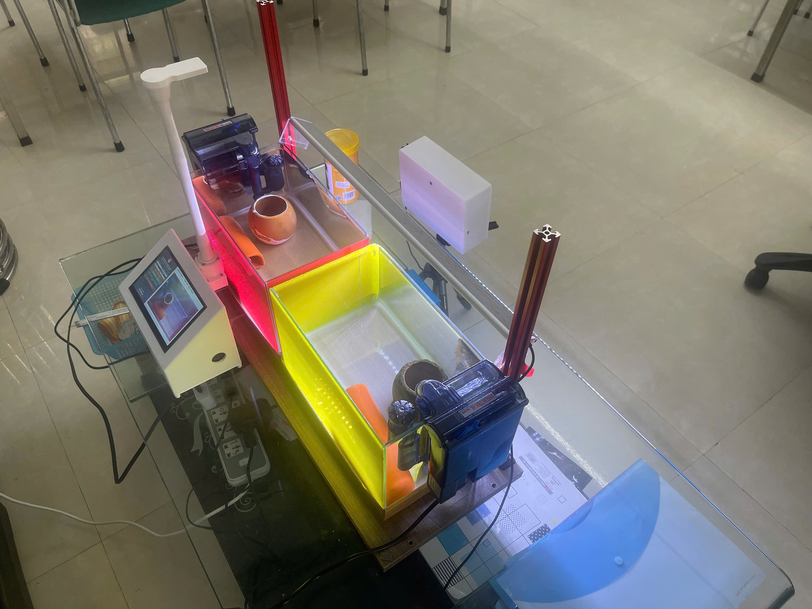

<!-- Generated from scientific source; do not edit this copy directly. -->

# Thu thập dữ liệu từ camera TOP và FRONT

<section class="journal-meta" aria-label="Thông tin bài nhật ký">
Mã nhật kýJ02

ExperimentEXP-02

Ngày2026-08-12

Trạng tháiĐã xác minh · VERIFIED

Evidencehigh

Cập nhật2026-08-29
</section>

## 1. Mục tiêu

Thu hình từ hai góc để mô tả chuyển động không gian tốt hơn một camera đơn và tạo dữ liệu đầu vào cho detection, tracking và behavior.

## 2. Vấn đề cần giải quyết

Camera TOP và FRONT quan sát các thành phần chuyển động khác nhau. Đồng thời, nền bể và điều kiện ghi có thể trở thành tín hiệu phụ khiến detector học nền thay vì hình dạng cá.

## 3. Thiết bị, dữ liệu và phần mềm

Working copy hiện có bốn raw video Front và hai raw video Top. Hai sensor JSON gắn với hai phiên TOP ngày 12/08/2026, tank `T2`, scenario `baseline`, độ phân giải ghi trong metadata là 1280×960.

## 4. Phương pháp thực hiện

TOP được dùng để quan sát quỹ đạo x–y, khoảng cách giữa track và phân bố nhóm. FRONT được dùng để quan sát vị trí theo chiều cao và chuyển động theo phương đứng. Hai camera được xử lý độc lập; không gán cùng `track_id` giữa hai góc nhìn.

## 5. Quá trình thực hiện

Dữ liệu được lưu thành video riêng theo camera. Hai phiên TOP được ánh xạ rõ: local `1.mp4` tương ứng phiên `20260812_130428_T2_1`; local `2.mp4` tương ứng original `4.mp4`, phiên `20260812_131321_T2_4`.

## 6. Kết quả và quan sát

Repository có đủ raw video local để tiếp tục pipeline cho cả TOP và FRONT. Metadata sensor xác nhận T2 cho hai phiên TOP. Phân bố T1/T2 trong dataset hoặc ý nghĩa sinh học của T1/T2 không được suy ra vì metadata hiện tại chưa đủ.

## 7. Vấn đề phát sinh

Không

## 8. Điều chỉnh và cải tiến

Nhóm đã chuyển sang dùng `session_id`, original filename, tank, scenario và timestamp trong sensor metadata. Các phiên sau nên có manifest camera chung để đối chiếu TOP/FRONT theo thời gian mà không đồng nhất identity.

## 9. Kết luận tại thời điểm thực hiện

Việc thu dữ liệu hai góc nhìn được xác minh bằng raw working copy và metadata phiên TOP. Kết quả đủ làm đầu vào nghiên cứu, nhưng không chứng minh cross-camera identity hay ý nghĩa riêng của T1/T2.

## 10. Minh chứng

- `data/raw/front/3.mp4`, `4.mp4`, `5.mp4`, `8.mp4` (local, ignored)
- `data/raw/top/1.mp4`, `2.mp4` (local, ignored)
- `data/raw/sensors/1.json`, `2.json` (local, ignored)
- [`environment_session_summary.csv`](https://github.com/khkt-tn/fish/blob/main/results/environment/environment_session_summary.csv)

## 11. Hình ảnh đề xuất

<!-- TODO_MEDIA:
source: data/raw/front/3.mp4
timestamp: 00:00:10
description: IMG-J02-02 frame FRONT
-->

<!-- TODO_MEDIA:
source: user-edited composite
timestamp: N/A
description: IMG-J02-03 TOP và FRONT đặt cạnh nhau; IMG-J02-04 T1/T2 chỉ thêm sau khi xác minh
-->

## Video minh họa

### V02 — Video raw camera TOP

  <iframe
    src="https://www.youtube.com/embed/pdNzzXow-tk"
    title="V02 — Video raw camera TOP"
    frameborder="0"
    allow="accelerometer; autoplay; clipboard-write; encrypted-media; gyroscope; picture-in-picture; web-share"
    allowfullscreen>
  </iframe>

### V03 — Video raw camera FRONT

  <iframe
    src="https://www.youtube.com/embed/DzVF1SNC4fw"
    title="V03 — Video raw camera FRONT"
    frameborder="0"
    allow="accelerometer; autoplay; clipboard-write; encrypted-media; gyroscope; picture-in-picture; web-share"
    allowfullscreen>
  </iframe>

*Khuyến nghị sử dụng video minh họa ngắn, tập trung vào phần dữ liệu cần kiểm chứng; không lưu video dung lượng lớn trực tiếp trong Git.*

## 13. Đóng góp của thành viên

`Quang Anh - Quốc Minh.

## 14. Công việc tiếp theo

Khóa manifest nguồn cho từng video và tiếp tục xây dựng dataset gán nhãn mà không trộn frame cùng đoạn video qua split.
