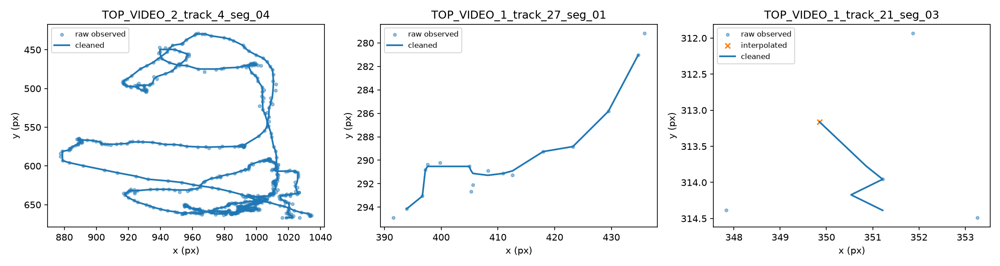
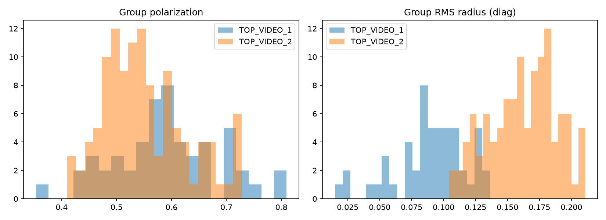

<!-- Generated from scientific source; do not edit this copy directly. -->

# Xây dựng đặc trưng hành vi cá

<section class="journal-meta" aria-label="Thông tin bài nhật ký">
Mã nhật kýJ06

ExperimentEXP-05

Ngày2026-08-19

Trạng tháiĐã xác minh · VERIFIED

Evidencehigh

Cập nhật2026-08-29
</section>

## 1. Mục tiêu

Chuyển trajectory theo thời gian thành các đại lượng định lượng có thể dùng để mô tả hành vi ở mức cá thể và mức nhóm.

## 2. Vấn đề cần giải quyết

Tọa độ tracker chứa gap, track ngắn và nhiễu. Nếu không làm sạch có kiểm soát, tốc độ và độ ngoặt có thể phản ánh lỗi tracking nhiều hơn chuyển động thật. Track ID cũng không được hiểu là danh tính sinh học.

## 3. Thiết bị, dữ liệu và phần mềm

Front feature pipeline đọc trajectory đã làm sạch, dùng cửa sổ 5 giây với bước 1 giây. TOP pipeline đọc `top_cleaned_trajectories.csv`, dùng cùng độ dài cửa sổ nhưng bổ sung feature không gian phù hợp góc nhìn từ trên.

## 4. Phương pháp thực hiện

### Cá thể

Front có các đại lượng như quãng đường, tốc độ, độ dịch chuyển, path efficiency, gia tốc, độ ngoặt, vị trí x/y chuẩn hóa và vùng không gian. TOP có thêm khoảng cách tới tâm/biên frame và nearest-neighbor distance.

### Nhóm

TOP mô tả số track đang quan sát, centroid nhóm, nearest-neighbor distance, pairwise distance, RMS radius, bounding/convex-hull area và polarization. Đây là descriptor trên frame, không phải nhãn sinh học.

## 5. Quá trình thực hiện

Front tạo 706 cửa sổ cá thể, 312 cửa sổ nhóm và schema 23 feature cho mô hình. TOP tạo 382 cửa sổ cá thể và 167 cửa sổ nhóm, kèm schema, QC và sáu plot đặc trưng/trajectory.

## 6. Kết quả và quan sát

Pipeline tạo được bảng feature tái sử dụng cho labeling, model và phân tích môi trường. Ở TOP, các phiên có feature như `mean_speed_diag_s`, `path_efficiency`, `mean_abs_turn_rad`, `mean_nnd_diag`, `mean_group_rms_radius_diag` và `mean_group_polarization`.

## 7. Vấn đề phát sinh

Identity fragmentation làm một cá có thể tạo nhiều trajectory segment. `n_active_tracks` không phải số cá thật; geometry chỉ theo frame vì chưa có calibration tank và scale vật lý.

## 8. Điều chỉnh và cải tiến

Nhóm giới hạn nội suy gap ngắn, không stitch khác ID, chuẩn hóa một số đại lượng theo đường chéo frame và ghi rõ coverage/interpolation. Feature có tên, unit và định nghĩa trong schema để tránh thay nghĩa khi dùng về sau.

## 9. Kết luận tại thời điểm thực hiện

Đặc trưng cá thể và nhóm đã được tạo và có provenance. Chúng hỗ trợ mô tả chuyển động quan sát được, nhưng không đủ để tự kết luận cá stress, sợ hãi, hung dữ, khỏe hay bệnh.

## 10. Minh chứng

- [`FRONT_BEHAVIOR_FEATURES_001/summary.json`](https://github.com/khkt-tn/fish/blob/main/logs/behavior/FRONT_BEHAVIOR_FEATURES_001/summary.json)
- [`front_behavior_feature_schema.json`](https://github.com/khkt-tn/fish/blob/main/results/behavior/front_behavior_feature_schema.json)
- [`TOP_BEHAVIOR_FEATURES_001/summary.json`](https://github.com/khkt-tn/fish/blob/main/logs/behavior/TOP_BEHAVIOR_FEATURES_001/summary.json)
- [`top_behavior_feature_schema.json`](https://github.com/khkt-tn/fish/blob/main/results/behavior/top_behavior_feature_schema.json)
- Commits `622a94b`, `cc74ce9`

## 11. Hình ảnh đề xuất

## 12. Video minh họa

> 🎥 **V07 — Video overlay tracking và đặc trưng hành vi**
>
> YouTube: Đang chờ cập nhật

## 13. Đóng góp của thành viên

`TO_VERIFY_WITH_STUDENTS`: chưa có evidence về người thiết kế feature, kiểm tra trajectory hoặc review schema.

## 14. Công việc tiếp theo

Khóa schema dùng trong phân tích, giữ cảnh báo fragmentation và chỉ xây dựng nhãn/model khi có protocol ground truth phù hợp.
