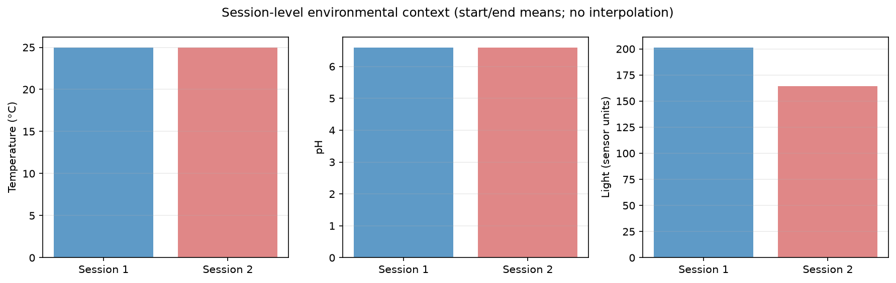

<!-- Generated from scientific source; do not edit this copy directly. -->

# Đồng bộ đặc trưng hành vi với dữ liệu môi trường

<section class="journal-meta" aria-label="Thông tin bài nhật ký">
Mã nhật kýJ08

ExperimentEXP-07

Ngày2026-08-29

Trạng tháiĐã xác minh · VERIFIED

Evidencehigh

Cập nhật2026-08-29
</section>

## 1. Mục tiêu

Ghép đúng phiên hành vi TOP với metadata cảm biến để mọi so sánh môi trường có nguồn và timestamp rõ ràng.

## 2. Vấn đề cần giải quyết

Sensor hiện chỉ có đọc đầu/cuối, không phải chuỗi thời gian mỗi giây. Nội suy giá trị cho từng cửa sổ hành vi sẽ tạo dữ liệu không được quan sát và làm kết luận sai mức phân giải.

## 3. Thiết bị, dữ liệu và phần mềm

Hai JSON có `temperature`, `ph`, `light`, `timestamp`, `session_id`, tank và scenario. Đầu vào hành vi là 382 cửa sổ cá thể và 167 cửa sổ nhóm từ Notebook 15.

## 4. Phương pháp thực hiện

Notebook 16 parse JSON, kiểm tra checksum, đối chiếu mapping local/original filename, kiểm tra timestamp đầu ≤ cuối và ghép context theo `video_id`. Mỗi cửa sổ nhận metadata cấp phiên; `sensor_interpolation` được đặt là `none`.

## 5. Quá trình thực hiện

`TOP_VIDEO_1` được ghép với session `20260812_130428_T2_1`; `TOP_VIDEO_2` local `2.mp4` được ghép với original `4.mp4`, session `20260812_131321_T2_4`. Hash behavior và sensor đều qua gate trước khi merge.

## 6. Kết quả và quan sát

Merge bảo toàn 382 row cá thể và 167 row nhóm. Phiên 1 có light mean 201,5; phiên 2 là 164,5. Cả hai đều temperature mean 25 và pH mean 6,6.

## 7. Vấn đề phát sinh

Không có dữ liệu sensor giữa phiên, nên không thể liên hệ biến động theo giây với từng window. Hai phiên đều T2/baseline và khác cả session lẫn light, tạo confounding.

## 8. Điều chỉnh và cải tiến

Nhóm gộp bước sensor sync và environment analysis vào Notebook 16, ghi rõ context cấp phiên và không tạo Notebook 17 riêng. Hash input giúp ngăn vô tình ghép lại với feature đã thay đổi.

## 9. Kết luận tại thời điểm thực hiện

Đồng bộ metadata cấp phiên được xác minh và đủ cho so sánh mô tả giữa hai phiên. Đây không phải đồng bộ sensor có độ phân giải theo cửa sổ và không hỗ trợ causal inference.

## 10. Minh chứng

- [`Notebook 16`](https://github.com/khkt-tn/fish/blob/main/notebooks/16_environment_behavior_analysis.ipynb)
- [`TOP_ENV_BEHAVIOR_001/config.yaml`](https://github.com/khkt-tn/fish/blob/main/logs/environment/TOP_ENV_BEHAVIOR_001/config.yaml)
- [`environment_session_summary.csv`](https://github.com/khkt-tn/fish/blob/main/results/environment/environment_session_summary.csv)
- Commit [`dbc51a9fec769a9f1754d5ba479f5b77317b39fd`](https://github.com/khkt-tn/fish/commit/dbc51a9fec769a9f1754d5ba479f5b77317b39fd)

## 11. Hình ảnh đề xuất

<!-- TODO_MEDIA:
source: data/raw/sensors/1.json and integrated CSV
timestamp: N/A
description: IMG-J08-01 sensor raw; IMG-J08-02 bảng merge; IMG-J08-03 time axis chỉ tạo khi có dữ liệu time-resolved thật
-->

## 12. Video minh họa

> 🎥 **V10 — Video cá đồng thời hiển thị dữ liệu môi trường**
>
> YouTube: Đang chờ cập nhật

## 13. Đóng góp của thành viên

`TO_VERIFY_WITH_STUDENTS`: cần xác nhận người kiểm tra mapping session và review sensor.

## 14. Công việc tiếp theo

Trong phiên thu mới, ghi sensor theo timestamp định kỳ hoặc thiết kế số phiên lặp phù hợp trước khi kiểm định thống kê.
