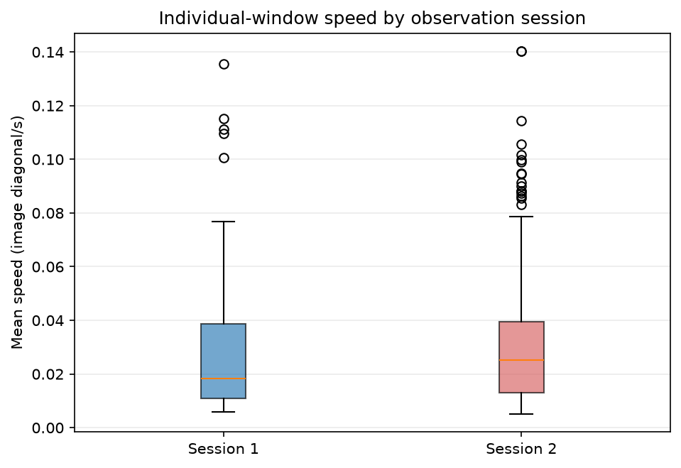
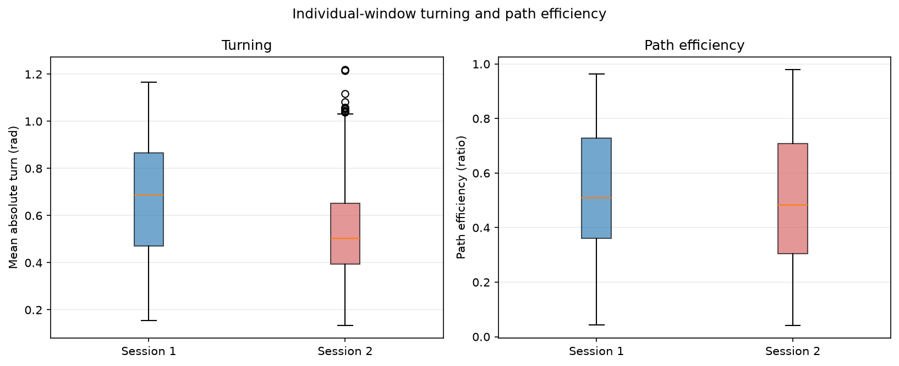
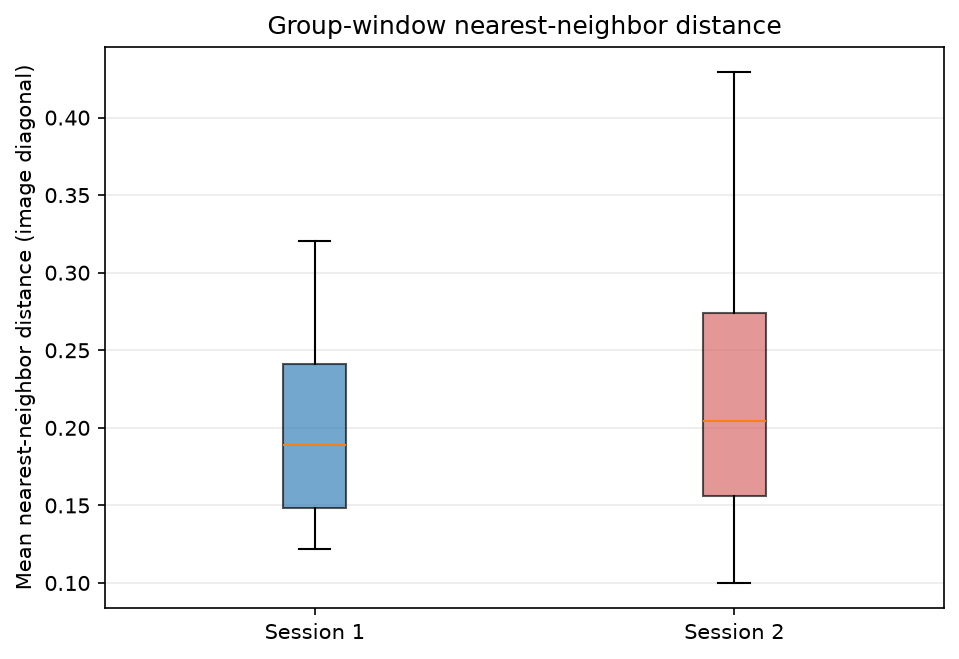
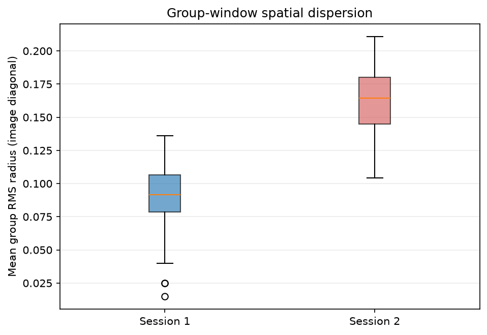
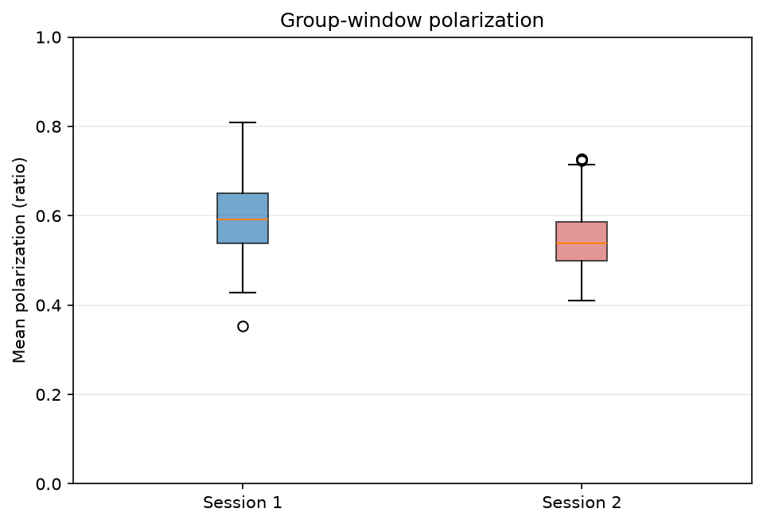

<!-- Generated from scientific source; do not edit this copy directly. -->

# Phân tích mối liên hệ giữa môi trường và hành vi

<section class="journal-meta" aria-label="Thông tin bài nhật ký">
Mã nhật kýJ10

ExperimentEXP-08

Ngày2026-08-29

Trạng tháiĐã xác minh · VERIFIED

Evidencehigh

Cập nhật2026-08-29
</section>

## 1. Mục tiêu

So sánh mô tả một số feature hành vi TOP giữa hai phiên đã ghép metadata môi trường, đồng thời xác định rõ điều gì chưa thể kết luận.

## 2. Vấn đề cần giải quyết

Hai phiên có cùng temperature/pH, khác light nhưng mỗi light level chỉ có một phiên. Các cửa sổ còn chồng lấp, nên không phải replicate độc lập và không phù hợp kiểm định causal.

## 3. Thiết bị, dữ liệu và phần mềm

Notebook 16 chạy trong Conda `fish`, Python 3.11.15, pandas 3.0.5, NumPy 2.1.3, matplotlib 3.11.1 và GPU RTX 3050. Input là sensor JSON cùng feature cá thể/nhóm đã khóa bằng SHA-256.

## 4. Phương pháp thực hiện

Nhóm chọn ba feature cá thể (`mean_speed_diag_s`, `path_efficiency`, `mean_abs_turn_rad`) và ba feature nhóm (`mean_nnd_diag`, `mean_group_rms_radius_diag`, `mean_group_polarization`). Với mỗi phiên, notebook tính n, mean, standard deviation, median, quartile và IQR; hiệu là phiên 2 trừ phiên 1.

## 5. Quá trình thực hiện

Notebook kiểm tra mapping, schema, window 5 giây, duplicate key và finite values trước khi tạo bảng. Không tính p-value, confidence interval, correlation hoặc regression vì thiết kế hiện tại không đủ.

## 6. Kết quả và quan sát

### Phân tích cá thể

Phiên 2 có mean speed cao hơn 0,000810 diag/s; path efficiency thấp hơn 0,032182; mean absolute turn thấp hơn 0,113262 rad so với phiên 1. Đây là khác biệt mô tả trong dataset hiện tại.

### Phân tích nhóm

Phiên 2 có mean nearest-neighbor distance cao hơn 0,027721 đường chéo frame, group RMS radius cao hơn 0,072229 và polarization thấp hơn 0,040718. Các đại lượng cho thấy nhóm được tracker quan sát có xu hướng phân tán hơn và alignment thấp hơn trong phiên 2, nhưng không chứng minh light gây ra thay đổi.

## 7. Vấn đề phát sinh

Session và light bị confound; temperature/pH không biến thiên; window chồng lấp; track identity phân mảnh; số active track không phải fish count. Vì vậy causal inference là `NOT_SUPPORTED`.

## 8. Điều chỉnh và cải tiến

Nhóm giới hạn phân tích ở mức descriptive observational comparison, gắn cảnh báo vào summary và giữ sáu plot cùng bảng nhỏ trong Git. Sensor không được nội suy.

## 9. Kết luận tại thời điểm thực hiện

Checkpoint 16 đạt `PASS_WITH_WARNING`: metadata integration hợp lệ và có những khác biệt hành vi quan sát được giữa hai phiên. Không thể kiểm tra hiệu ứng temperature/pH và không thể quy khác biệt cho light hoặc một nguyên nhân môi trường cụ thể.

## 10. Minh chứng

- [`TOP_ENV_BEHAVIOR_001/summary.json`](https://github.com/khkt-tn/fish/blob/main/logs/environment/TOP_ENV_BEHAVIOR_001/summary.json)
- [`environment_behavior_summary.csv`](https://github.com/khkt-tn/fish/blob/main/results/environment/environment_behavior_summary.csv)
- [`environment_behavior_comparison.csv`](https://github.com/khkt-tn/fish/blob/main/results/environment/environment_behavior_comparison.csv)
- [`environment_session_summary.csv`](https://github.com/khkt-tn/fish/blob/main/results/environment/environment_session_summary.csv)
- Commit [`dbc51a9fec769a9f1754d5ba479f5b77317b39fd`](https://github.com/khkt-tn/fish/commit/dbc51a9fec769a9f1754d5ba479f5b77317b39fd)

## 11. Hình ảnh đề xuất

## 12. Video minh họa

> 🎥 **V11 — Tổng hợp pipeline video → tracking → behavior → environment analysis**
>
> YouTube: Đang chờ cập nhật

Thời lượng đề xuất: 2–4 phút.

## 13. Đóng góp của thành viên

`TO_VERIFY_WITH_STUDENTS`: không dùng Git author để suy ra đóng góp khoa học của từng học sinh.

## 14. Công việc tiếp theo

Tiến hành audit tái lập và thiết kế thêm phiên lặp/điều kiện độc lập trước khi thực hiện kiểm chứng thống kê.
